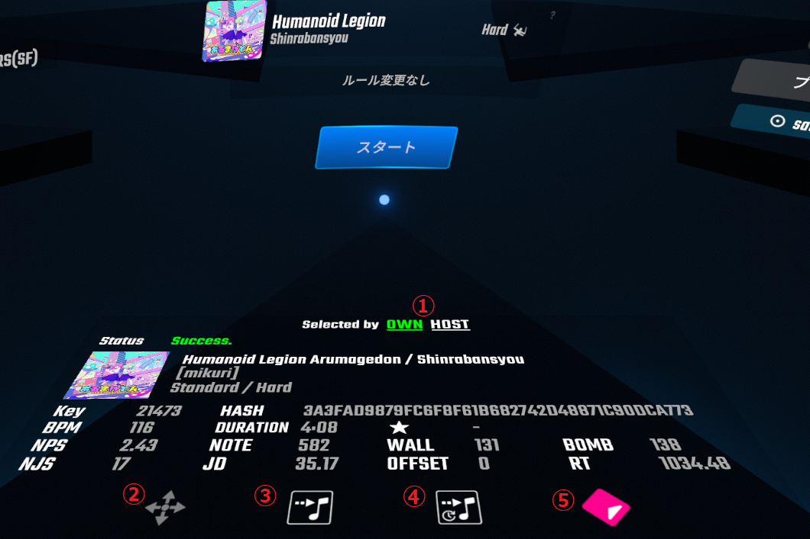

# MultiplayerLevelInformation

MultiplayerLevelInformation is a Beat Saber mod that display information such as NJS, JD, RT, etc... for custom maps in multiplayer lobbies.

Support multiplay: BeatTogether / BeatSaberPlus_Multiplayer

MultiplayerLevelInformation は、マルチプレイヤーロビーにカスタムマップの NJS、JD、RT などの情報を表示する Beat Saber の mod です。

BeatTogether か BeatSaberPlus_Mutiplayer のマルチプレイをサポートします。

① OWN 自身が選択している譜面の情報を表示します。

① HOST ホストが選択している譜面の情報を表示します。

② トリガーボタンを使ってウィンドウをドラッグすることができます。

③ 譜面選択画面を表示している状態でクリックするとウィンドウに情報を表示している譜面の位置にジャンプします。表示中のプレイリスト内に該当譜面がない場合はジャンプしません。

④ 譜面選択画面を表示している状態でクリックすると最後にプレイした譜面の位置にジャンプします。表示中のプレイリスト内に該当譜面がない場合はジャンプしません。

⑤ クリックするとウィンドウに情報を表示している譜面のBeatSaverのページをPCのブラウザで開きます。

